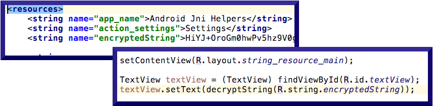
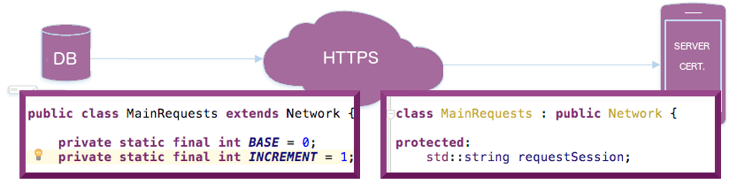

# Android JNI Helpers #

Tools for writing secure Android/JNI code, based upon Spotify's [Jni Helpers Library](https://github.com/spotify/JniHelpers.git).

## String Decryption ##



Prepare your strings before runtime and decrypt them as you need them.

## Secure Network Calls ##



Connect to any secure server with its designated ssl certificate (in C++).

## How it works ##

You may already know, but in Android development we need to hide important details of our apps from basic apk decompilation. Here is a [demonstration](https://www.youtube.com/watch?v=TfLq9nsLWOc)  of how easy apk decompilation truly is, using the online decompiler [javadecompilers](http://www.javadecompilers.com/apk).

This library allows you to secure your apps with less effort and is fully customizable. It protects your app's resources like inline (Java file) strings, resource (res) strings and network requests beyond
[basic code shrinking](https://developer.android.com/studio/build/shrink-code.html) from [proguard obfuscation](https://www.guardsquare.com/en/proguard).


## Setup ##
### Add C++ Support, but if your project already has it skip this section ###
- If you are just creating your project, you can simply check the "Add C++ Support" box upon project creation
- If your project already exists, you can right click your app module and select "Link C++ project with gradle"
- Finally, see our [FAQ](FAQ.md) for how to [set up your CMakeLists.txt](FAQ.md#set-up-your-cmakelists)

### Import the library ###
Add Jitpack.io repo
```groovy
allprojects {
    repositories {
        ...
        maven { url 'https://jitpack.io' }
    }
}
```
Import (demo, decryption & network) modules
```bash
dependencies {
    compile 'com.github.the-mac:AndroidJniHelpers:1.1.0'
}
compile 'com.github.the-mac:AndroidJniHelpers:1.1.0'
```

## Usage ##
### String Decryption ###
Incorporate String Resource Encryption
```xml
<resources>
    <string name="app_name">Android Jni Helpers</string>
    <string name="action_settings">Settings</string>
    <string name="encryptedString">HiYJ+OroGm0hwPv5hz9V0g==</string>
    ...
</resources>
```

Here we are requesting the decrypted string in an Activity's onCreate method:
```Java
    @Override
    public void onCreate(Bundle bundle) {
        super.onCreate(bundle);
        String decryptedString = decryptString(R.string.encryptedString);
    }
```

To allow the decryptString method to work, you must declare the JNI method (in Java) then implement it (in C/C++)
```Java
package us.the.mac.example.app;
...
public class ExampleActivity extends Activity {
    ...
    public native String decryptString(int resource);
}
```

Finally,  set up the decryptString native method implementation in C/C++
```C++
extern "C"
jstring
Java_us_the_mac_example_app_ExampleActivity_decryptString(JNIEnv* env, jobject java_this, jint resourceId) {
    // REQUEST STRING RESOURCE FROM strings.xml
    jstring stringResource = getStringNative(env, java_this, resourceId);

    // THIS IS YOUR CUSTOM ENCRYPTED STRING CLASS
    YourEncryptedString es = YourEncryptedString(env);
    es.encryptedString = env->GetStringUTFChars(stringResource, JNI_FALSE);

    // USE AN ALGORITHM OF YOUR CHOICE TO DECRYPT HERE
    return es.decryptNative(env, YourEncryptedString::RESOURCE_STRINGS_ALGORITHM);
}
```

### Secure Network Calls ###
Create a custom Network subclass
```Java
public class MainRequests extends Network {
    ...    
    public static final int HTTP_BIN = ...;
    private static final String API_KEY = "apiKey";
    public static native MainRequests getInstance();

    public MainRequests setKey(String key) {
        put(API_KEY, key);
        return this;
    }
}
```
Using a MainRequests Java instance could look as follows:
```Java
    MainRequests object = MainRequests.getInstance().setKey("1234");
    object.request(MainRequests.HTTP_BIN);

    JSONObject jsonObject = new JSONObject(object.resultString);
```
## Demo Project ##
[the-mac/AndroidJNIHelpers/demo](https://github.com/the-mac/AndroidJniHelpers/tree/master/demo)

## ProGuard
Nothing to include

# Contributing #
## Contribution Process

1. Submit an issue describing your proposed change to the repo in question.
1. The repo owner will respond to your issue promptly.
1. If your proposed change is accepted, and you haven't already done so, sign a
   Contributor License Agreement (see details below).
1. Fork the desired repo, develop and test your code changes.
1. Ensure that your code adheres to the existing style of the library to which
   you are contributing.
1. Ensure that your code has an appropriate set of unit tests which all pass.
1. Submit a pull request and cc the repo owner @cdm2012

## Contributor License Agreements ##

We'd love to accept your sample apps and patches! Before we can take them, we have to jump a couple of legal hurdles.

Please fill out either the individual or corporate Contributor License Agreement
(CLA).

  * If you are an individual writing original source code and you're sure you
    own the intellectual property, then you'll need to sign an
    [individual CLA](https://developers.google.com/open-source/cla/individual).
  * If you work for a company that wants to allow you to contribute your work,
    then you'll need to sign a
    [corporate CLA](https://developers.google.com/open-source/cla/corporate).

Follow either of the two links above to access the appropriate CLA and
instructions for how to sign and return it. Once we receive it, we'll be able to
accept your pull requests.

## Installing locally ##

* Clone the repo into your project:
```bash
git clone https://github.com/the-mac/AndroidJniHelpers.git
```
* Edit your project structure:
```bash
Go to File > Project Structure
```
* Add module into your project:
```bash
Click on "+" sign to add new module
```
* Import Gradle project:
```bash
Click "Import Gradle Project" option
```
* Paste path to AndroidJniHelpers library project
```bash
Paste "path/to/your/project/AndroidJniHelpers" folder into Source directory
```
* Name New Module (you could name its module library):
```bash
By default the existing name should be library ":library", but can be updated
```

* Rewrite the app/CMakeLists.txt similar to the following (you can find an example [here](library/CMakeLists.txt)):
```cmake
cmake_minimum_required(VERSION 3.4.1)

set(local_DIR ${CMAKE_CURRENT_SOURCE_DIR}/src/main/cpp)
set(library_JniHelpers_DIR ${CMAKE_CURRENT_SOURCE_DIR}/../AndroidJniHelpers/library/src/main/cpp)
set(library_JniHelpersTest_DIR ${CMAKE_CURRENT_SOURCE_DIR}/../AndroidJniHelpers/library/src/androidTest/cpp)

file(GLOB libLocal_SOURCES ${local_DIR}/*.cpp)
file(GLOB libLocal_HEADERS ${local_DIR}/*.h)

file(GLOB libJniHelpers_SOURCES ${library_JniHelpers_DIR}/*.cpp)
file(GLOB libJniHelpers_HEADERS ${library_JniHelpers_DIR}/*.h)

file(GLOB libJniHelpersTest_SOURCES ${library_JniHelpersTest_DIR}/*.cpp)
file(GLOB libJniHelpersTest_HEADERS ${library_JniHelpersTest_DIR}/*.h)

link_directories(${JNI_LIBRARIES})
add_library(JniHelpers STATIC ${libLocal_SOURCES} ${libJniHelpers_SOURCES})
add_library(JniHelpersTest STATIC ${libLocal_SOURCES} ${libJniHelpers_SOURCES} ${libJniHelpersTest_SOURCES})
include_directories(${local_DIR} ${library_JniHelpers_DIR} ${library_JniHelpersTest_DIR})


if(${ANDROID_TESTING})
    set(library_NAME "test-lib")
    set(library_Entry_Point "src/androidTest/cpp")
else()
    set(library_NAME "native-lib")
    set(library_Entry_Point "src/main/cpp")
endif()

add_library( # Sets the name of the library.
             ${library_NAME}

             # Sets the library as a shared library.
             SHARED

             # The following toggles between the native-lib and test-libs
             # files, based upon whehther a test is currently running.
             ${library_Entry_Point}/${library_NAME}.cpp )


find_library( # Sets the name of the path variable.
              log-lib

              # Specifies the name of the NDK library that
              # you want CMake to locate.
              log )


# Only adding JniHelpersTest library if testing
if(${ANDROID_TESTING})
    target_link_libraries(${library_NAME} JniHelpers JniHelpersTest ${log-lib} )
else()
    target_link_libraries(${library_NAME} JniHelpers ${log-lib} )
endif()
```
**Note: If you're creating JNI helper tests,
you should run them on an Android device and
using the test-lib reference above (inside your
androidTest/cpp folder). Also the
ANDROID_TESTING flag is passed in from the
build.gradle script, check out an example of
that [here](library/build.gradle)**